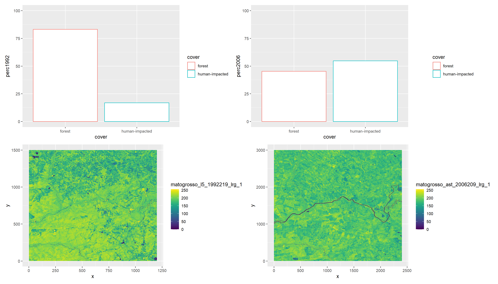

# Using ggplot to show change in time

Once a datafarme has been built with the following code:

``` r

library(terra)
library(imageRy)
library(ggplot2)
library(patchwork)

cover <- c("forest", "human-impacted")
perc1992 <- c(83, 17)
perc2006 <- (45, 55)
mato_grosso_df <- data.frame(cover, perc1992, perc2006)
```

We can plot the change in time of distinct classes in a composite figure:

```
# plot the relative cover by class
cover_1992_plot <- ggplot(mato_grosso_df, aes(x=cover, y=perc1992, color=cover)) +
                   geom_bar(stat="identity", fill="white") +
                   ylim (0, 100)
cover_1992_plot
cover_2006_plot <- ggplot(mato_grosso_df, aes(x=cover, y=perc2006, color=cover)) +
                   geom_bar(stat="identity", fill="white")  +
                   ylim (0, 100)
cover_2006_plot
cover_1992_plot + cover_2006_plot

# plot using the imageRy package
im.list()
mato1992 <- im.import("matogrosso_l5_1992219.lrg.jpg")
mato1992 <- im.ggplot(mato1992, 1)
mato2006 <- im.import("matogrosso_ast_2006209_lrg.jpg")
mato2006 <- im.ggplot(mato2006, 1)
Composite_plot <- (cover_1992_plot | cover_2006_plot) /
                  (mato1992 | mato2006)
Composite_plot
```

The resulting image would look like this:


