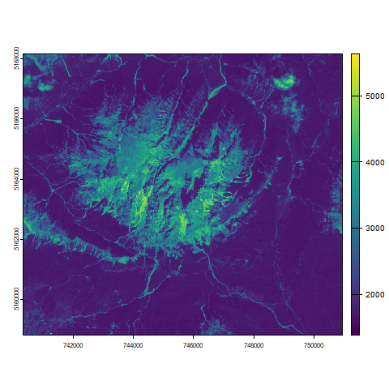

# RSAD01
Remote sensing training with Duccio Rocchini


## Languages used during the training 📚
The following langugaes will be used:
+ Markdown
+ R
+ LaTex
  
## Packages used
+ terra
  + remote sensing data analysis
  + matrix data management
+ ggplot2
  + new graphs
  + graphical editing
 
> the course material will be available for one month

## Example of code
Wiht the following code, we can attain the following image:

``` r
png("b2.png")
plot(b2)
dev.off()
```


