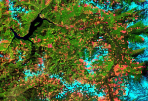

# RSAD01
Remote sensing training with Duccio Rocchini

## Languages used during the training 📚
The following langugaes will be used:
+ Markdown
+ R
+ LaTex
  
## Packages used
+ terra
  + remote sensing data analysis
  + matrix data management
+ ggplot2
  + new graphs
  + graphical editing
 
> the course material will be available for one month
